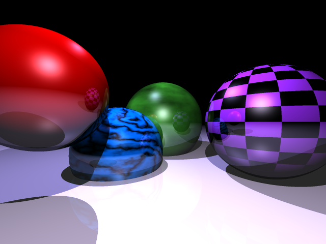

Vertex is a work-in-progress raytracer writen in go.

You have probably reached this place by accident : do not expect great code quality, I write this thing in order to learn the language.

# Current result

# Features/Todo

The current image status can be seen in the [out](out) directory.

 - [x] introduce basic algorithm
 - [x] antialiasing
 - [x] introduce simple lighting
 - [x] add shadows
 - [x] add reflection
 - [x] command line parameters
 - [ ] Other intersections
   - [ ] Plane
   - [ ] Torus
   - [ ] Cylinder
 - [ ] Refraction
 - [x] Lambert shading
 - [x] Blinn phong for specular highlights (pretty costly)
 - [x] Texture mapping
   - [x] File image
   - [x] Checkboard
 - [ ] Bump mapping 
 - [ ] Space partitionning
 - [ ] Displacement mapping
 - [x] Cool generated textures
   - [x] Perlin noise
   - [x] Wood
   - [x] Marble
 - [ ] load scene from file (simple json ?)
 - [ ] Add save to PPM file format
 - [ ] Depth of field
 - [ ] Soft shadows
 - [ ] Better antialiasing (adaptative, poisson disk-based random sampling ?)
 - [ ] Metaballs. Just because metaballs

Go further, to infinity and beyond !

# Run the scene

In order to generate the raytraced scene with 3x3 antialiasing, reflection with 2 level with output in raytrace.png, run :

    ./Vertex -as=3 -depth=2 -output="raytrace.png"

For other parameters, get help with :

    ./Vertex --help 
