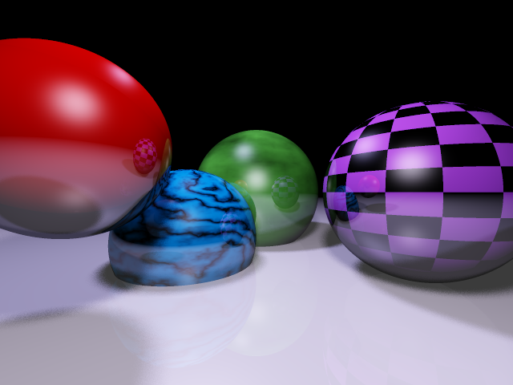
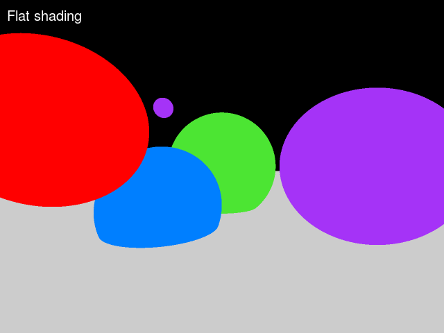

Vertex is a work-in-progress raytracer writen in go.

You have probably reached this place by accident : do not expect great code quality, I write this thing in order to learn the language.

# Current result

Pretty much all the current features are here : random dynamic textures on spheres, lights with specular highlights, reflection, soft shadows, anti-aliasing, exposure and gamma correction.

The first versions were quick to generate (1-3 seconds), but throwing a lot of rays for the softshadows and reflection, along with the blinn-phong specular highlight computation starts to slow things down. This picture took 1mn 57 to generate.

This is normal since the time complexity of the raytracing is a linear function of the number of rays. When you send 16 more ray, for soft shadows, the algorithm is 16 times slower.

Evolution of the project :

# Features/Todo

The current image status can be seen in the [out](out) directory.

 - [x] introduce basic algorithm
 - [x] antialiasing
 - [x] introduce simple lighting
 - [x] add shadows
 - [x] add reflection
 - [x] command line parameters
 - [ ] Other intersections
   - [ ] Plane
   - [ ] Torus
   - [ ] Cylinder
 - [ ] Refraction
 - [x] Lambert shading
 - [x] Blinn phong for specular highlights (pretty costly)
 - [x] Gamma correction
   - [ ]should be configurable (toggle yes/no)
 - [x] Exposure correction 
   - [ ] should be configurable (cli options or configuration file)
   - [ ] add possibility to choose between the different exposure methods
 - [x] Texture mapping
   - [x] File image
   - [x] Checkboard
 - [x] Cool generated textures
   - [x] Perlin noise
   - [x] Wood
   - [x] Marble
 - [ ] Bump mapping 
 - [ ] Displacement mapping
 - [ ] Space partitionning
 - [ ] load scene from file (simple json ?)
 - [ ] Add save to PPM file format
 - [ ] Depth of field
 - [x] Soft shadows
 - [ ] Better antialiasing (adaptative, poisson disk-based random sampling ?)
 - [ ] Metaballs. Just because metaballs

Go further, to infinity and beyond !

# Run the scene

In order to generate the raytraced scene with 3x3 antialiasing, reflection with 2 level with output in raytrace.png, run :

    ./Vertex -as=3 -depth=2 -output="raytrace.png"

For other parameters, get help with :

    ./Vertex --help 

The gif is generated thanks to the bash file [generategif.sh](generategif.sh)